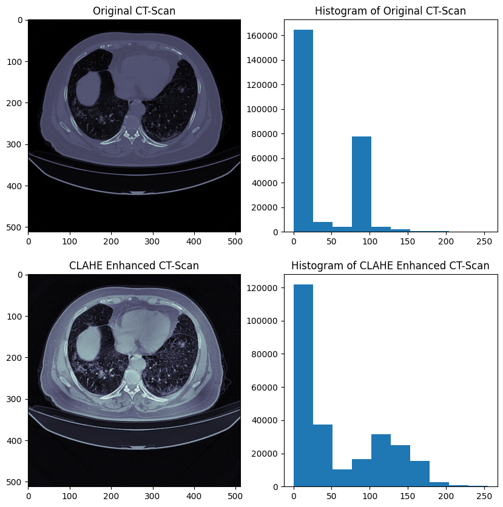
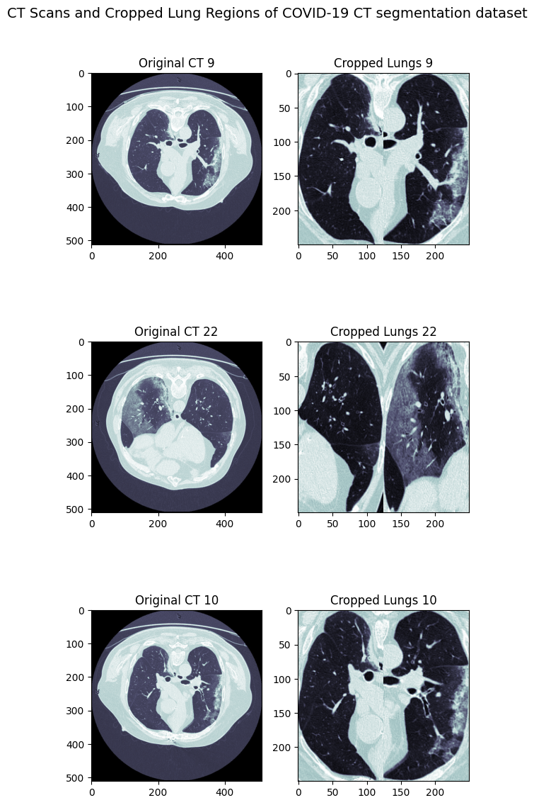
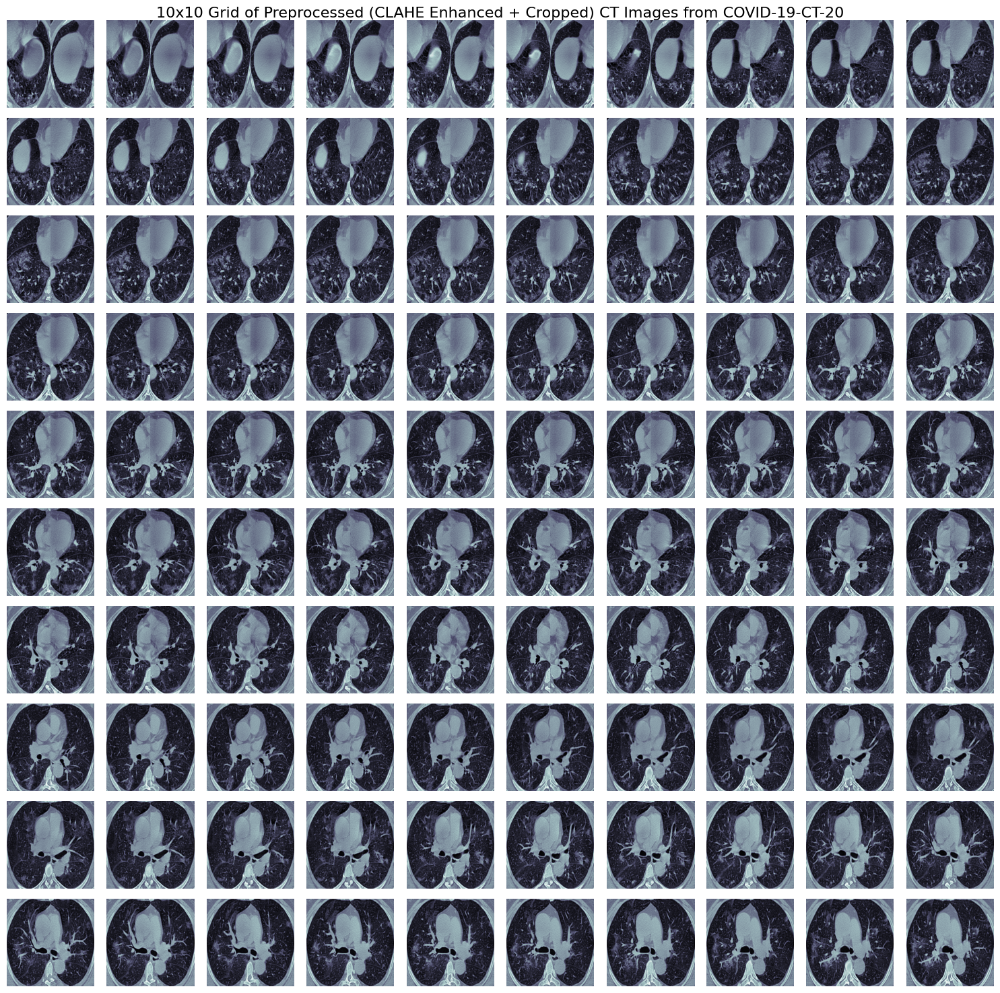
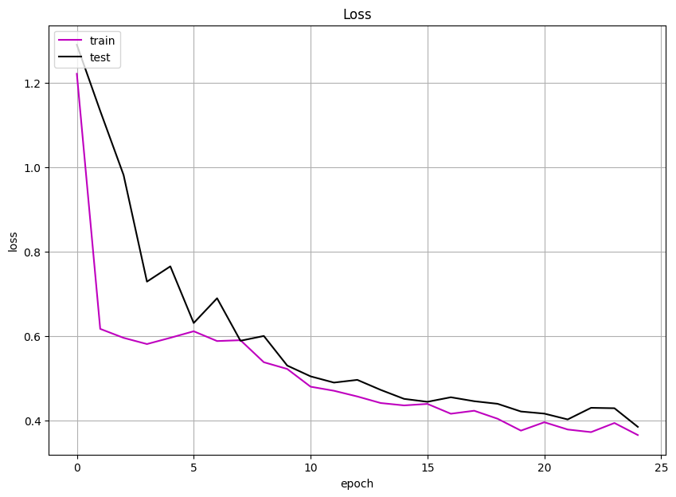
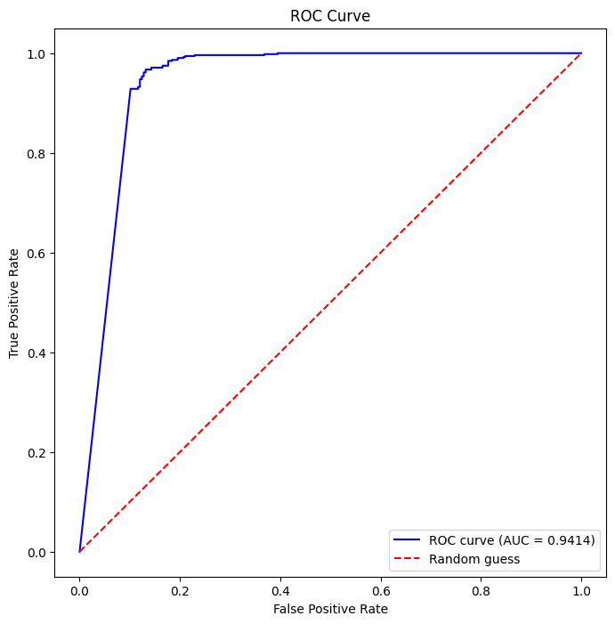
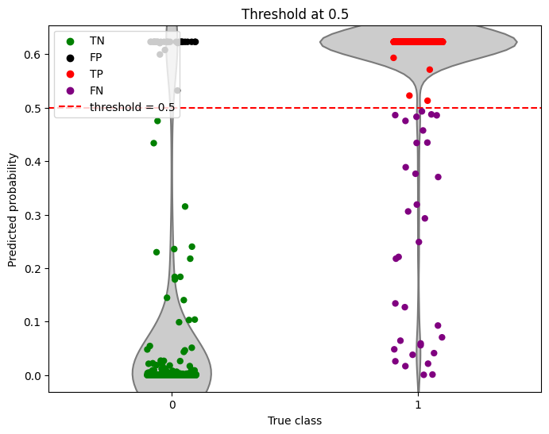

# Enhanced CT Diagnosis for COVID-19

## Project Overview

This project develops an enhanced deep learning approach for automated COVID-19 diagnosis from CT scan images. The research focuses on implementing advanced image preprocessing techniques combined with convolutional neural networks to achieve high accuracy in distinguishing between COVID-19 positive and negative cases from chest CT scans.

## Objective

The primary objective is to create a robust and accurate automated diagnostic system that can:
- Process CT scan images with enhanced preprocessing techniques
- Classify CT scans as COVID-19 positive or negative
- Achieve high sensitivity and specificity for clinical deployment
- Provide interpretable results for medical professionals

## Methodology

### Data Sources
The project utilizes two comprehensive datasets:
1. **COVID-19-CT-20 Dataset**: Provides 20 CT scan cases with corresponding lung and infection masks
2. **COVID-19 CT Segmentation Dataset**: Additional CT scans with detailed segmentation masks

### Data Preprocessing Pipeline

#### 1. CLAHE Enhancement
Contrast Limited Adaptive Histogram Equalization (CLAHE) is applied to enhance image contrast and visibility of lung structures.


*Figure 1: Original CT scan (up) vs CLAHE enhanced CT scan (down) with corresponding histograms*

#### 2. Lung Region Cropping
Automated lung segmentation and cropping is performed to focus on regions of interest:
- Contour detection to identify lung boundaries
- Bounding box extraction for both lungs
- Fusion of bilateral lung regions


*Figure 2: CT scan processing pipeline showing original image, cropped lung regions, and final preprocessed output*

#### 3. Dataset Composition
- **Dataset 1**: 691 Non-COVID cases, 1,421 COVID-19 cases
- **Dataset 2**: 194 Non-COVID cases, 303 COVID-19 cases
- **Total**: 885 Non-COVID cases, 1,724 COVID-19 cases

### Model Architecture

A custom Convolutional Neural Network (CNN) architecture featuring:
- Multiple convolutional blocks with batch normalization
- Progressive feature extraction (16 → 32 → 64 filters)
- MaxPooling for dimensionality reduction
- Dropout regularization (40%) to prevent overfitting
- Binary classification output with sigmoid activation


*Figure 3: Sample of preprocessed CT images showing the effectiveness of CLAHE enhancement and lung cropping*

### Training Configuration
- **Optimizer**: Adam (learning rate: 5e-4)
- **Loss Function**: Binary crossentropy
- **Batch Size**: 32
- **Epochs**: 25
- **Class Weighting**: Applied to handle dataset imbalance
- **Validation Split**: 70% training, 30% validation

## Results

### Model Performance
The trained model demonstrates excellent performance on the validation set:

#### Classification Metrics
```
              precision    recall  f1-score   support
           0     0.8764    0.8797    0.8780       266
           1     0.9380    0.9362    0.9371       517

    accuracy                         0.9170       783
   macro avg     0.9072    0.9079    0.9076       783
weighted avg     0.9171    0.9170    0.9170       783
```

#### Key Performance Indicators
- **Overall Accuracy**: 91.70%
- **ROC-AUC Score**: 0.9414
- **COVID-19 Detection Precision**: 93.80%
- **COVID-19 Detection Recall**: 93.62%
- **F1-Score**: 93.71%


*Figure 4: Training and validation loss curves showing model convergence*


*Figure 5: ROC curve demonstrating excellent discriminative performance (AUC = 0.9414)*

### Threshold Analysis
The model's performance was evaluated at different classification thresholds to optimize sensitivity and specificity trade-offs.


*Figure 6: Violin plot showing prediction probability distributions for different classes and threshold analysis*

